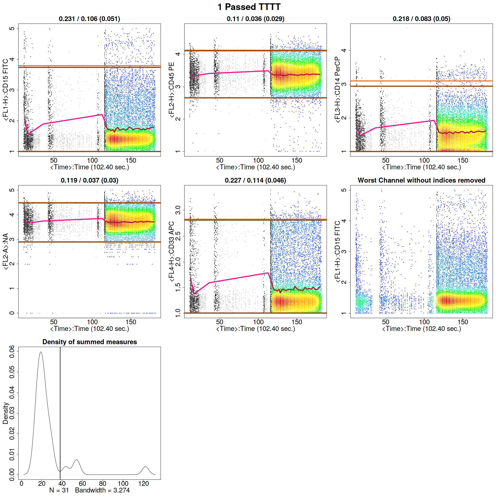
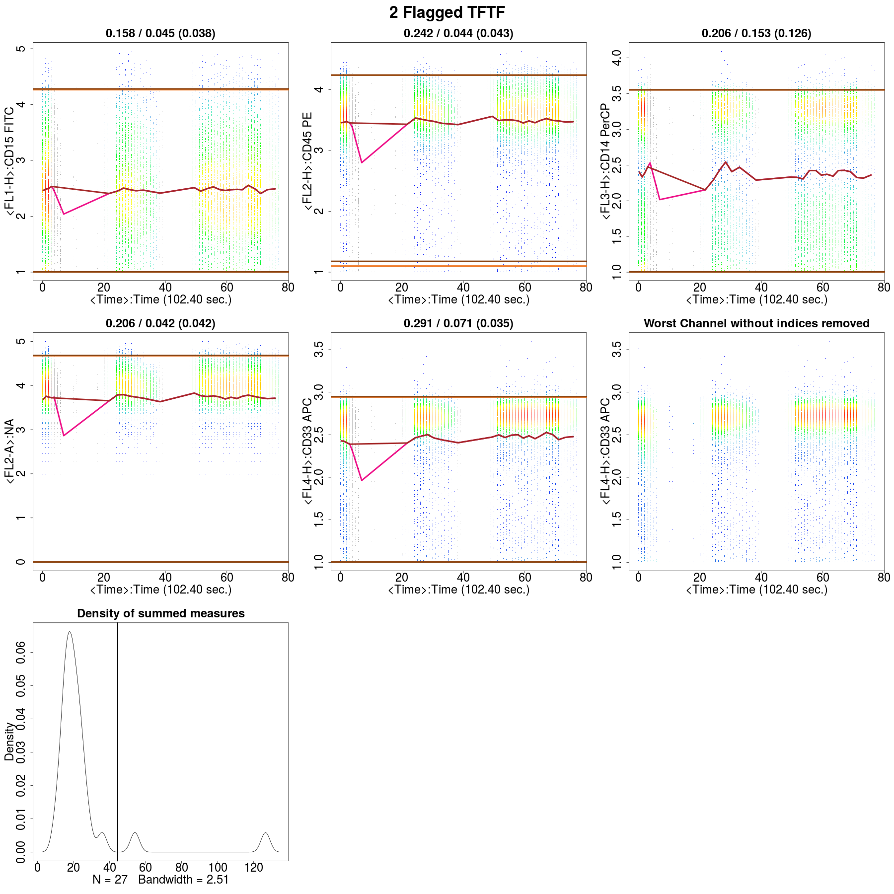
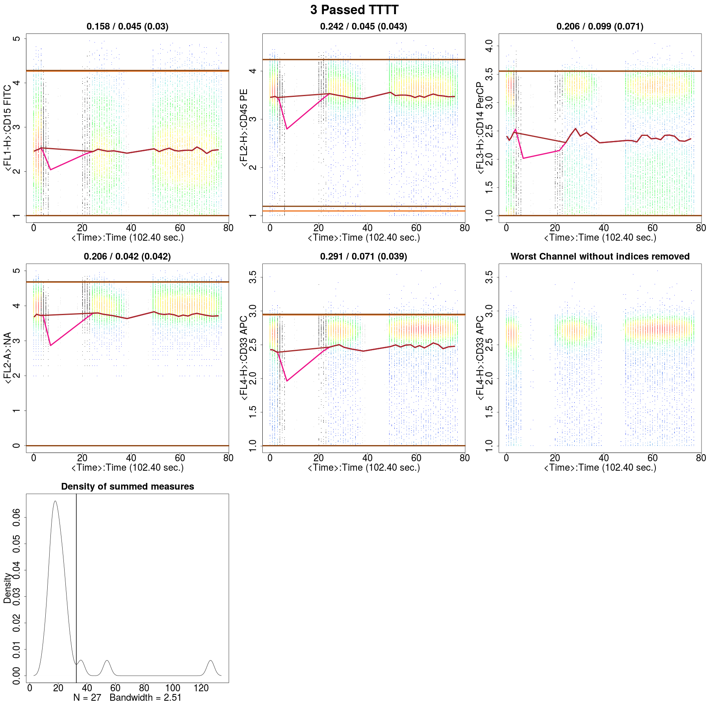
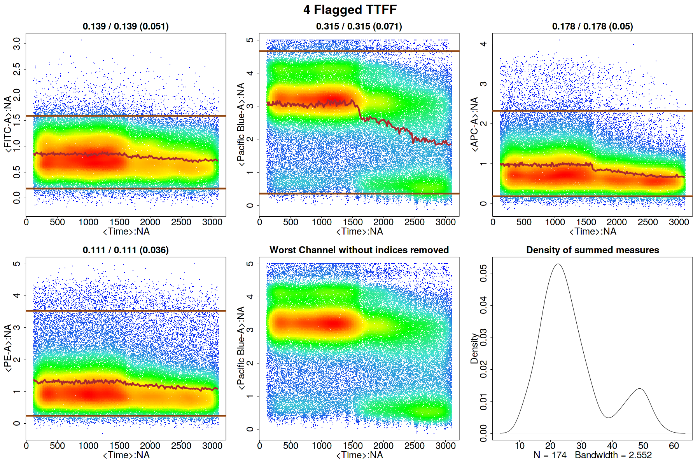
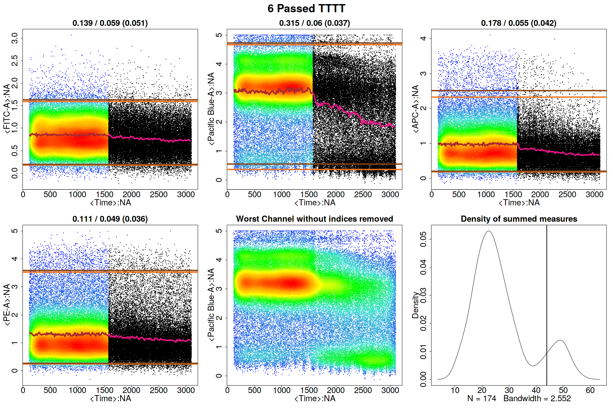
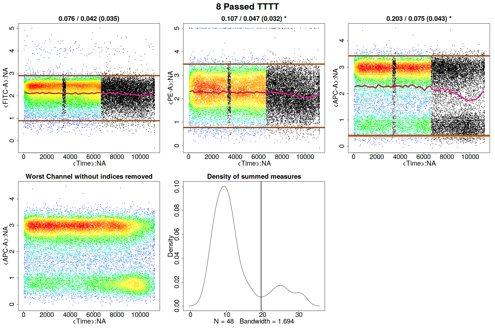
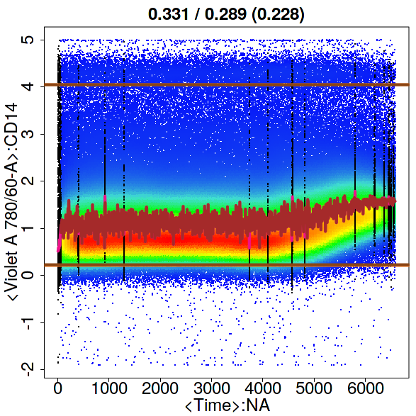
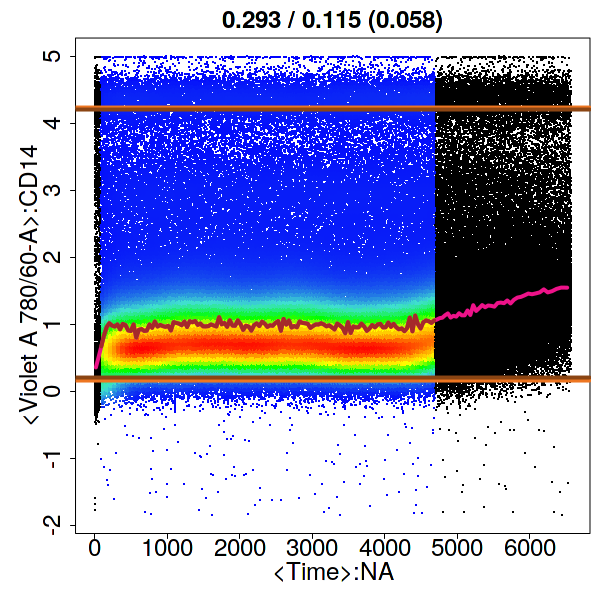

---
title: "**flowCut**: Precise and Accurate Automated Removal of Outlier Events and Flagging of Files Based on Time Versus Fluorescence Analysis"
author: Justin Meskas, Sherrie Wang
email: jmeskas@bccrc.ca, swang@bccrc.ca
date: January 18, 2018
output:
  pdf_document: default
  html_document: default
---


# Loading the Library

To install _**flowCut**_, type _source("http://bioconductor.org/biocLite.R")_ into R and then type \newline _biocLite("flowCut")_. For more information on installation guidelines, see the Bioconductor and the CRAN websites. Once installed, to load the library, type the following into R:

```{r, label=Load_Library, warning=FALSE, message=FALSE, echo=TRUE, fig=FALSE, results='hide'}
library("flowCut")
```

# Running _**flowCut**_

## Introduction

_**flowCut**_ automatically removes outlier events in flow cytometry data files due to abnormal flow behaviours resulting from clogs and other common technical problems. Our approach is based on identifying both regions of low density and segments (default size of 500 events) that are significantly different from the rest.

Eight measures of each segment (mean, median, 5th, 20th, 80th and 95th percentile, second moment (variation) and third moment (skewness)) are calculated. The density of the summation, over both the 8 measures of each segment and all cleaning channels, gives a density of summed measures distribution. This distribution, accompanied with two parameters (_MaxValleyHgt_ and _MaxPercCut_), will determine which segments are significantly different from the other segments. The segments that are significantly different will have all of their events removed. We also flag files if they display any of the following: 1) not monotonically increasing in time, 2) sudden changes in fluorescence, 3) large gradual change of fluorescence in all channels, or 4) very large gradual change of fluorescence in one channel. (During this vignette four digit codes of only Ts and Fs will be seen, ex. TFTF. These codes are a pass/flag of the 4 flagging test).

## Data
The _**flowCut**_ dataset contains flowFrames borrowed from the _flowCore's_ GvHD dataset and from FlowRepository, an open source cytometry data repository. The first two flowFrames are GvHD flowFrame objects 's9a06' and 's5a07'.  The third flowFrame is from FlowRespository's experiment FR-FCM-ZZ7E with file name 'Macrophages $+$ oATP.fcs'. The fourth is from FlowRespository's experiment FR-FCM-ZZVB with file name 'Specimen\_001\_B6 LSK.fcs'. We pre-loaded the compensated and transformed data into the _**flowCut**_ library. To load all the data used in the examples of this vignette, type:

```{r,label=Load_Data, fig=FALSE, results='hide'}
data(flowCutData)
```

## Simple Example
We run _**flowCut**_ with default parameters with the exception of _FileID_ that gives a name to the figure and _Plot_ that is changed to 'All' so we can see the results even if the file is perfectly cleaned. The default for _Plot_ is 'Flagged Only' which would only plot the flagged files. Throughout this vignette all the examples will produce a figure in a folder called flowCut in your current directory. As an alternative _PrintToConsole_ can be changed to 'TRUE' which allows the image to be printed in R as opposed to being saved as a file. If you would prefer this alternative, simply add _PrintToConsole=TRUE_ to all _**flowCut**_ commands.

 <!-- And the default for _PrintToConsole_ is 'FALSE', which would print the images to the folder called flowCut in your current directory. These defaults were chosen because we believe _**flowCut**_ will mostly be used on large datasets where a manual validation on all figures is not practical, and we also believe _**flowCut**_ may have some false positives but a very low amount of false negatives when it flags a file. With that in mind, _PrintToConsole_ will be set to 'TRUE' throughout this vignette, but in practice its default 'FALSE' would be used more often. -->


```{r, label=SimpleExample_Image, fig=FALSE, echo=TRUE, height=22, width=22, keep.source=TRUE}
res_flowCut <- flowCut(flowCutData[[1]], FileID = 1, Plot = "All")
```



A list containing four elements will be returned. The first element, _\$frame_, is the flowFrame file returned after _**flowCut**_ has cleaned the flowFrame. The second element, _\$ind_, is a vector containing indices of segments being removed, in relation to the original flowFrame. The third element, _\$data_, is a table containing computational information that users can access. The fourth element, _\$worstChan_, is the index of the channel with the most drift over time before cleaning. The _\$data_ element is shown here as an example:

```{r, label=SimpleExample_Data, fig=FALSE, echo=TRUE}
res_flowCut$data
```


Having the _Plot_ parameter set to 'All' above created a plot in the flowCut folder under your current working directory, which is the same as Figure \ref{fig:SimpleExample}. The first five sub-plots in Figure \ref{fig:SimpleExample} are the channels that undergo fluorescence analysis from _**flowCut**_. The segments that are removed because they are significantly different are coloured black. The removed low density sections lower than _LowDensityRemoval_, defaulted at 0.1 (10$\%$), are coloured grey. **The low density sections are calculated by first creating a density distribution. Then the parts of the distribution curve that are less then 10$\%$ of the max value are removed. This is independent of the rest of the the algorithm and is done first and has no association to the binning of the segments (i.e. any number of events can be removed and not just an integer amount of the segment size). On the other hand, events removed from being part of a significantly different segment are removed altogether as a segment and no one single event could be removed this way.**

The numbers on top of each of the five plots indicate mean drift before cutting, mean drift after cutting and the max one step change (in the bracket). The mean drift is calculated as the difference of the maximum mean and the minimum mean divided by the 2-98 percentile difference of the data. This would catch any gradual changes or fluctuations in the file. If the mean drift becomes significant, the file is flagged. The parameters _MeanOfMeans_ and _MaxOfMeans_ control the strictness of these flags, and we recommend not to change these numbers unless a greater or weaker strictness is desired. The _MeanOfMeans_ parameter is the threshold for the average of the range of means of all channels, where _MaxOfMeans_ is the threshold just for the channel with the highest range of means. The value in the bracket is associated to the parameter _MaxContin_, which indicates the changes of the means between adjacent segments in each channel. This parameter would catch abrupt mean changes such as spikes. The default is 0.1 and we recommend not to change this value.

The top and bottom horizontal dark brown lines correspond to the 98th and the 2nd percentile of the data after cleaning. The 98th and 2nd percentile lines for the full data before cleaning are coloured in light brown, but are most likely not seen. Most of the time these two sets of lines are indistinguishable on the plot because there is no significant change in percentiles before and after cleaning. We found the top and bottom 2$\%$ of the events are spread out too much and do not serve as a nice max and min value of the file when comparing the range of the means to the range of the file.

Connecting all the means of each segment gives the brown line in the middle. Sometimes you can see that the brown line has some pink parts. The pink parts are the mean of each segment before cleaning. With the difference between pink and brown, the user can see which segments are removed, and perhaps understand why as well. Of course this only shows the mean measure of the 8 measures used to judge if a segment is removed or not, so information on the other 7 measures is not shown.

The 8 statistical measures _**flowCut**_ calculates from each segment are summed up (and over all cleaning channels) to obtain a single statistical number for each segment. If we plot the density of these summed measures for every segment, then we obtain the last plot in Figure \ref{fig:SimpleExample}. The _deGate_ function in _flowDensity_ gives us the cutoff line on the density curve. Any segment with a summed value larger than the cutoff line will be removed.

The title of the image will display if the file passed or it was flagged (This information is also visable in _\$data_). In Figure \ref{fig:SimpleExample} a '1 Passed TTTT' is displayed. The '1' is for the file's ID, 'Passed' is stating the file passed and 'TTTT' is showing that it has passed all flagging tests (please see Introduction for the four flagging tests).

## Changing the Parameter _**MaxValleyHgt**_
This example will show what _MaxValleyHgt_ does and how changing the value will affect the segment deletion analysis.

The _MaxValleyHgt_ parameter plays a role with calculating the threshold on the density of summed measures distribution. _MaxValleyHgt_ defines the upper limit of the ratio of the height of the intersection point where the cutoff line meets the density plot and the height of the maximum peak. Setting the number higher can potentially cut off more events, whereas lowering the number will potentially reduce it.

For example, if we set _MaxValleyHgt_ to 0.01 we have:

```{r, label=MaxValleyHgt0p01_Image, fig=FALSE, echo=TRUE, height=22, width=22, keep.source=TRUE}
res_flowCut <- flowCut(flowCutData[[2]], FileID=2, Plot ="All", MaxValleyHgt = 0.01)
```




The file is flagged because the statistically different regions are not completely removed, shown in Figure \ref{fig:MaxValleyHgt0p01}. There are three small bumps in the 'Density of summed measures' sub-plot, which each represent one segment. Also note, that the threshold is set at around 45. If we change the _MaxValleyHgt_ back to its default value 0.1, we get Figure \ref{fig:MaxValleyHgt0p1}. Here the file has now passed and is cleaned properly. note that the threshold is now around 33, and hence all three bumps/segments are removed:

```{r, label=MaxValleyHgt0p1_Image, fig=FALSE, echo=TRUE, height=22, width=22, keep.source=TRUE}
res_flowCut <- flowCut(flowCutData[[2]], FileID=3, Plot ="All", MaxValleyHgt = 0.1)
```



## Changing the Parameter _**MaxPercCut**_
Sometimes we get files that show a distinctive separation of good and undesired segments, as shown in the 'Density of summed measures' sub-plot in Figure \ref{fig:MaxPercCut0p15}. We first show _MaxPercCut_ changed to 0.15 as a demonstration:

```{r, label=MaxPercCut0p15_Image, fig=FALSE, echo=TRUE, height=22, width=22, keep.source=TRUE}
res_flowCut <- flowCut(flowCutData[[3]], FileID=4, Plot ="All", MaxPercCut = 0.15)
```



_MaxPercCut_ defines the maximum percentage of events allowed to be removed. The default value is 0.3, which means _**flowCut**_ can remove 30 percent of the total events. However, with setting it at 0.15 we did not let _**flowCut**_ remove any segments since _**flowCut**_ needs to remove more than 15$\%$. If we change it back to the default of 0.3 we have a result shown in Figure \ref{fig:MaxPercCut0p2}:

```{r, label=MaxPercCut0p3_Image, fig=FALSE, echo=TRUE, keep.source=TRUE}
res_flowCut <- flowCut(flowCutData[[3]], FileID=5, Plot ="All", MaxPercCut = 0.3)
```


With _MaxPercCut_ set at 0.3, a large section is removed. This large section is actually much bigger than 30$\%$.

```{r, label=EventsRemoved_1}
res_flowCut$data["% of events removed",]
```

_**flowCut**_ could potentially remove more depending on the nature of the file. As with this example, where there is a large amount of mean drift. If multiple segments have been removed in a row, _**flowCut**_ will extend this removal section until the bordering segment has less than or equal to 1 standard deviation away from the mean of the means of the segments still not removed. **In other words, segments to the far right were first selected as significantly different and marked for removal. However, *__flowCut__* then extended its range to the left until the brown mean line showed a more flattened behaviour throughout the file.**

To convince you and to illustrate this in a different way, we can compare the results of setting _GateLineForce_ to 44 (shown in Figure \ref{fig:GateLineForce_44}) with our previous result from Figure \ref{fig:MaxPercCut0p2}:

```{r, label=GateLineForce_44_Image, fig=FALSE, echo=TRUE, height=22, width=22, keep.source=TRUE}
res_flowCut <- flowCut(flowCutData[[3]], FileID=6, Plot ="All", GateLineForce=44)
```



Even though the gating threshold has changed we still have the same amount of events removed.

```{r, label=EventsRemoved_2}
res_flowCut$data["% of events removed",]
```

This happened because in both cases there was a large section in a row removed and _**flowCut**_ expanded the section until all that was left was not too variant.

 <!-- Comparing with Figure \ref{fig:MaxPercCut0p2}, we can see that two different gate line position resulting in the same amount of removal which is more than than 20 percent. In the presence of large amount bad events, especially in the case of large amount of mean drift as illustrated in the example, the limit of this threshold is not strickly obeyed in order to properly clean files. In cases where 20 percent is not sufficient, that is, files being flagged after first attempted removal, we recommend changing this parameter to 0.5. -->

## Parameters _**UseOnlyWorstChannels**_ and _**AllowFlaggedRerun**_

Sometimes abnormal behaviours are only present in a few channels. The outlier events in these channels can be washed out when taking into consideration all measures in all channels. As a result, outliers in these channels are not properly removed. In these cases, we can use the parameter _UseOnlyWorstChannels_ to only focus on these specific channels.

In other cases, some files may contain two or more groups of outlier events, where one group of outliers is significantly different than the others. The first round of _**flowCut**_ will remove the most significantly different outlier groups while other outlier groups are masked by the worst ones. This issue can be addressed by using the parameter _AllowFlaggedRerun_, which will rerun the algorithm a second time if it has been flagged the first time.

An example of when both the above parameters are required is shown in Figure \ref{fig:AllowFlaggedRerun_UseOnlyWorstChannels}, but first showing results of _**flowCut**_ with default values.

```{r, label=AllowFlaggedRerun_UseOnlyWorstChannels_Image_1, fig=FALSE, echo=TRUE, height=22, width=22, keep.source=TRUE}
res_flowCut <- flowCut(flowCutData[[4]], FileID=7, Plot ="All")
```


The section for time greater than approximately 11000 is drastically different than the rest of the file, however, the section with time between 7500 and 11000 is still different enough and should be removed. The most deviant population of events have been removed. But, the file is still flagged because the third channel shows a mean drift that's more than the defaulted value for _MaxOfMeans_. It would be a good idea to run _**flowCut**_ again on this file to remove the mean drift events. One thing to be noted here is that the mean drift occurs strongly in only one channel. To properly catch those events and to counter the averaging effect, we need to set the _UseOnlyWorstChannels_ parameter to 'TRUE'. The result of the second round of cleaning and using only the worst channels is shown in Figure \ref{fig:AllowFlaggedRerun_UseOnlyWorstChannels_2}. Please note the asterisks in the figure, which show which channels were selected as the worst channels.

```{r, label=AllowFlaggedRerun_UseOnlyWorstChannels_Image_2, fig=FALSE, echo=TRUE, height=22, width=22, keep.source=TRUE}
res_flowCut <- flowCut(flowCutData[[4]], FileID=8, AllowFlaggedRerun = TRUE,
                    UseOnlyWorstChannels = TRUE, Plot="All")
```




In this example two channels were selected as the worst channels. The parameters _AmountMeanRangeKeep_ and _AmountMeanSDKeep_, defaulted at 1 and 2 respectively, determine how many channels of each type of worst channel detection are chosen as a worst channel. _AmountMeanRangeKeep_ looks for the channels that have the highest range in their segments means. _AmountMeanSDKeep_ looks for the channels that have the highest variance (SD) in their segments means. With the defaults, _**flowCut**_ will return either 3 worst channels if there is no overlap or 2 worst channels if there is overlap, as there is in the above example. **Please note that when using _UseOnlyWorstChannels_, it will calculate the worst channels independently for each file.**

## _**Segment**_ Size
The size of _Segment_ can significantly impact the result of _**flowCut**_. The algorithm groups 500 events together in a segment and compares the measures of the segment against all other segments. The number of 500 has proven successful on almost all files. We advise not to lower or increase this number unless there are specific reasons to do so. Without enough events in each segment, statistics start becoming less meaningful. 500 is small enough to catch spikes from clogs but large enough for good statistics. And spikes that take up 1000 events in a 1 000 000 event file do not have analogous spikes of 10 events in a 10 000 event file. The spikes will still be 1000 events in a 10 000 event file. With that being said, there are cases that it makes sense to change the segment size.

Depending on the size of the file, there is an optimal amount of events to be grouped together for the best performance of the outlier detection. Users should ensure there are at least 100 segments in total (total event count divided by _Segment_) for analysis for small files. For large files, users could increase the _Segment_ parameter if large fluctuation in the mean is causing an inaccurate detection of outliers (i.e. if the brown line is too variable then increasing the _Segment_ parameter may be beneficial). For example, we analyzed a 65MB file (hence data not attached) with the _Segment_ parameter equal to 500. Figure \ref{fig:500} shows large fluctuations in the means and random segment deletions without catching the mean drift. However, if we increase _Segment_ to 5000, the algorithm can correctly detect and remove the part of the events that are deviant. The result is shown in Figure \ref{fig:5000}.

{width=40%}

{width=40%}
